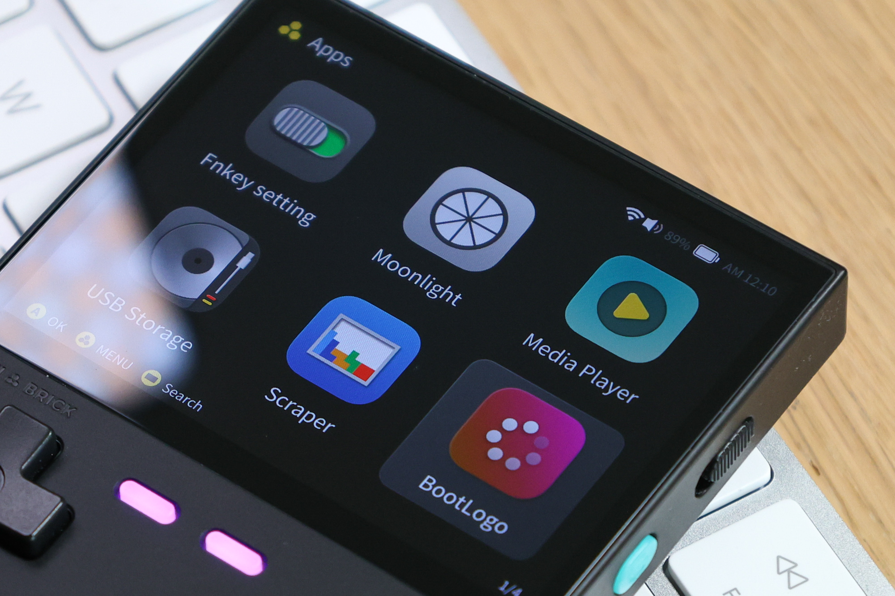
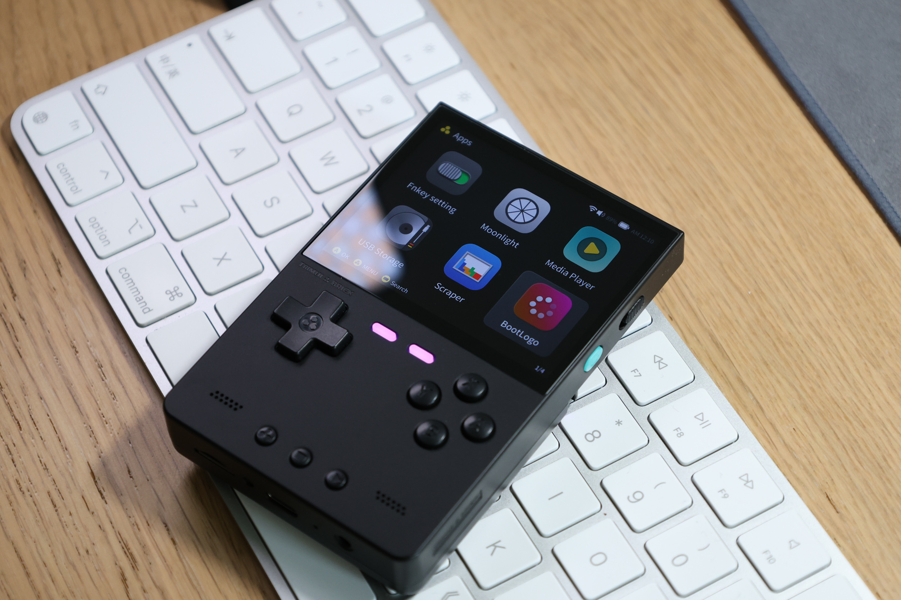
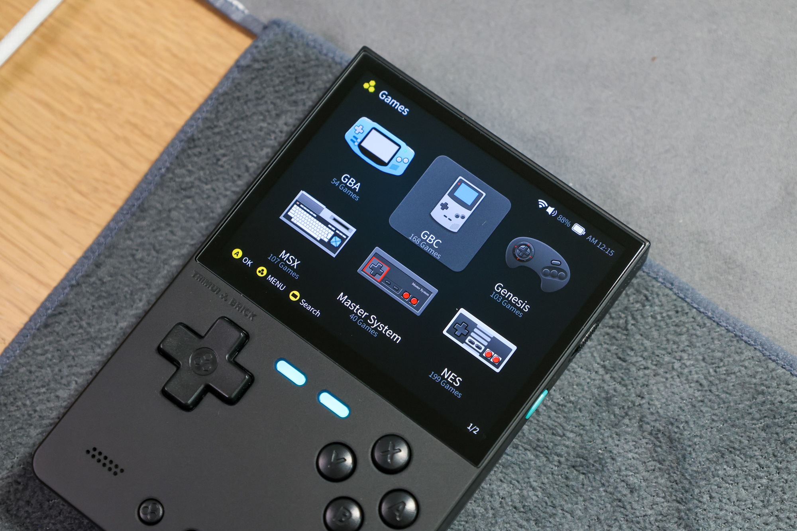
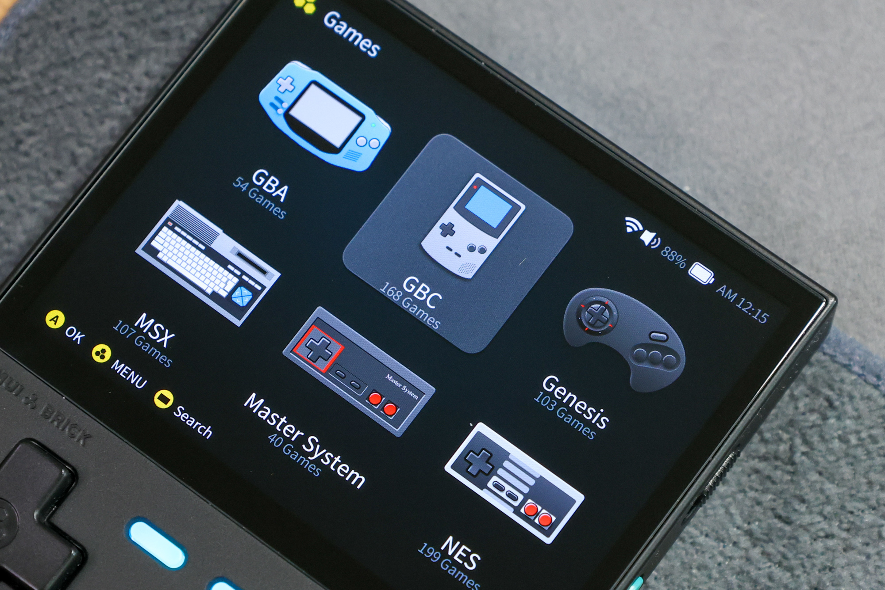
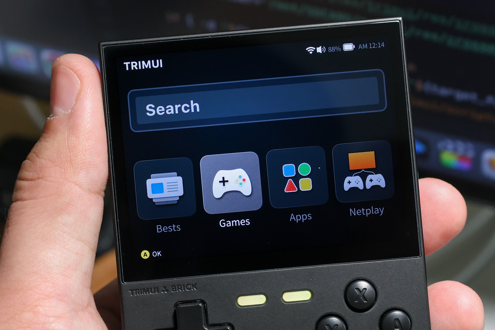
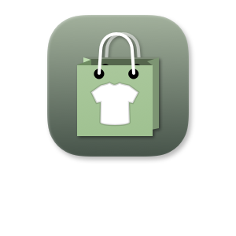
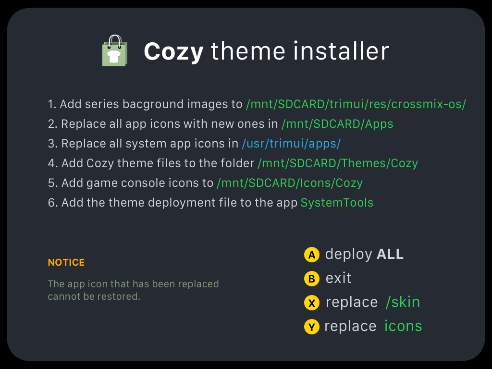

[查看中文说明 →](./README_ch.md)

# Theme Cozy for TrimUI Brick
for TrimUI Brick（[CrossMix OS](https://github.com/cizia64/CrossMix-OS/tree/Brick)）











## Instructions - Theme files only

1. Download the project file.
   

2. Copy the folder `CozyBrick/ThemeFiles/Themes/Cozy` to your SD card's `Themes` folder.
3. **Settings** -> **Themes** -> **Cozy**


## Instructions - fully - App install

> [!IMPORTANT]  
> Your TrimUI Brick's version need to be CrossMix v1.3.0 (Brick branch)  
> You can find the latest version in [https://github.com/cizia64/CrossMix-OS/tree/Brick](https://github.com/cizia64/CrossMix-OS/tree/Brick)

It would take several copy-and-paste actions to apply a theme, so to make the process more convenient, I’ve created an app to handle it.   
You can use this app by following the instructions below.

1. Download the project file.
   

2. Place the `CozyBrick` folder into your SD card's `Apps` folder.
3. Insert the SD card into your Brick device and reboot it.
4. Switch to the Apps tab, where you’ll see an app named **CozyBrick**.  
      
5. Open the app to view the instructions, as shown below:
    

6. Press <kbd>A</kbd> to automatically install the Cozy theme onto your SD card. This includes:
   - theme deploy file `Cozy.sh`
   - theme files
   - replace all app's icon into cozy style (irreversible)
7. Navigate to **System Tools** -> **Theme** -> **Cozy** to switch to the Cozy theme.
8. Done! Enjoy your new theme.

The app icon in Brick has been using topicon as its icon now, and the icon layout is not compatible with the original "icon" option in the app's config.json file. And CorossMix also has not made adjustment for this. So I have decided to use "icon" as the app's icon.
After you fully install this theme into your device, you will find that the icons of the apps that come with the stock are different from the others in size. That's because they are using "topicon" as their icons.
So here is what you need to do:

1. Open SSH. `Apps` -> `SystemTools` -> `NETWORK` -> `SSH` (enable it)
    Connect your device with SSH. User: `root`, password: `tina`
2. Go to the folder `/usr/trimui/apps/` You will find four apps in this folder:
   - fn_editor
   - moonlight
   - player
   - usb_storage
    
    There is a config.json file in each app folder. What you need to do is open those files and replace "icon" in them with the "topicon" content, leave "icontop" to ""
    Like this:
    ```json
    {
    "label":"Media Player",
    "label.ch.lang":"...............",
    "icon":"ic-media-player.png",
    "icontop":"",
    "launch":"launch.sh",
    "description":"TRIMUI Media Player",
    "description.ch.lang":"TRIMUI Media Player"
    }
    ```
    After this, enter an app and then exit it. You will see the changes. The size of the system icons will be the same as that of the other apps.


## Instructions - fully - Manual install

> [!IMPORTANT]  
> Your TrimUI Brick must be running version 1.3.0.  
> You can find the latest version at [https://github.com/cizia64/CrossMix-OS/tree/Brick](https://github.com/cizia64/CrossMix-OS/tree/Brick)

The process of manual installation is exactly the same as app installation.   
Therefore, I recommend using the app to install this theme.

Only consider manual installation if the app installation is not feasible for you.   
This situation may arise if you’ve made significant changes to CrossMix OS's file structure.


1. Download the project file.
   

2. Copy the folder `CozyBrick/ThemeFiles/Themes/Cozy` to your SD card's `Themes` folder.
3. On your TrimUI Brick, navigate to: **Settings** -> **Themes** -> **Cozy**.
4. The basic theme files will now be applied

### ADVANCED FILE REPLACEMENT


1. Match and replace all normal app icon files in `/mnt/SDCard/Apps/` with the corresponding files in `/CozyBrick/ThemeFiles/Apps/`.
2. Match and replace all system app icon files in `/usr/trimui/apps/` with the corresponding files in `/CozyBrick/ThemeFiles/usr/trimui/apps/`.
3. Add the BootLogo file `/CozyBrick/ThemeFiles/BOOT_LOGO/COZY.bmp` to the folder `/mnt/SDCARD/Apps/BootLogo/Images/`.
4. Add the theme deployment file `/CozyBrick/ThemeFiles/Cozy.sh` to the folder `/mnt/SDCARD/Apps/SystemTools/Menu/THEME##THEME PACK (value)/`.
5. Copy the folder `/CozyBrick/ThemeFiles/Icons/Cozy/` into the folder `/mnt/SDCARD/Icons/`.
6. Copy the folder `/CozyBrick/ThemeFiles/trimui/res/crossmix-os/style_Cozy/` into the folder `/mnt/SDCARD/trimui/res/crossmix-os/`.
7. Navigate to **System Tools** -> **Theme** -> **Cozy** to switch to the Cozy theme.
8. Done! Enjoy your new theme.


## Credit

**Font noto-sans:** from [fontsource](https://github.com/fontsource/fontsource)


## Other themes

I’ve previously created themes for three other open-source handheld devices. Feel free to check them out if you’re interested!

- **Cosy for Miyoo Mini+** `OnionOS` [onion-theme-cosy](https://github.com/KyleBing/onion-theme-cosy)
- **Cosy for Miyoo Flip** `StockOS` [theme-cosy-miyoo-flip-stock](https://github.com/KyleBing/theme-cosy-miyoo-flip-stock)
- **Cosy for Miyoo A30** `SpruceOS` [spruce-theme-cosy](https://github.com/KyleBing/spruce-theme-cosy)

Here are some retro console icon files available for you to use freely.
- [retro-game-console-icons](https://github.com/KyleBing/retro-game-console-icons)


## Struct

```shell
CozyBrick/
└── ThemeFiles
    ├── Apps
    │   ├── BootLogo
    │   ├── EbookReader
    │   ├── EmuCleaner
    │   ├── FileManager
    │   ├── MusicPlayer
    │   ├── OTA-update
    │   ├── PortMaster
    │   ├── Reboot
    │   ├── RetroArch
    │   ├── Scraper
    │   ├── ScreenRecorder
    │   │   └── icon
    │   ├── SystemTools
    │   ├── Terminal
    │   ├── random
    │   └── user_guide
    ├── BOOT_LOGO
    ├── Icons
    │   └── Cozy
    │       └── Emus
    ├── Themes
    │   └── Cozy
    │       ├── skin
    │       └── sound
    ├── trimui
    │   └── res
    │       └── crossmix-os
    │           └── style_Cozy
    └── usr
        └── trimui
            └── apps
                ├── fn_editor
                ├── moonlight
                ├── player
                └── usb_storage

37 directories

```
